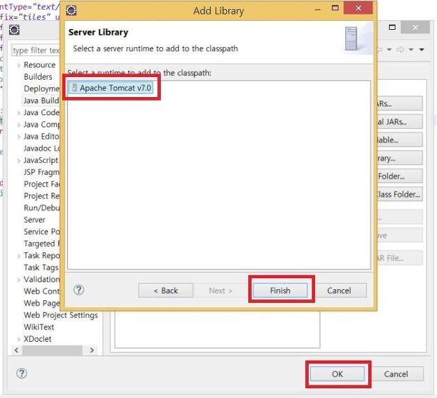

```
이클립스를 재설치해서 기존의 소스를 수정하려는데 밑의 오류가 나타났습니다.
request.getContextPath()라는 오류입니다.
구글링을 통해서 확인을 해보니 JAVA Build Path에 Apache-Tomcat을 추가하지 않아서 나타나는 현상이었습니다.
해결법은 이브러리에 Apache-Tomcat을 추가하면 됩니다.
                    
```


1. 일단 프로젝트를 우클릭하거나 상단의 프로젝트 메뉴를 통해서 Properties로 들어갑니다.


2. 왼쪽 메뉴의 Java Build Path에 Libraries의 Add Library로 들어갑니다.


3. Server Runtime을 선택을 선택하고 Next> 버튼을 클릭합니다.


4. 자신의 PC에 설치된 Apache Tomcat을 보여줍니다.
 선택한 후 Finish버튼을 클릭합니다.


5. 마지막으로 OK버튼을 클릭해서 추가를 해준 뒤 소스를 확인해보면 request.getContextPath()에 빨간줄이 없어지는 것을 볼 수가 있습니다.




여기까지 request.getContextPath()에 오류를 해결하는 방법이었습니다.        