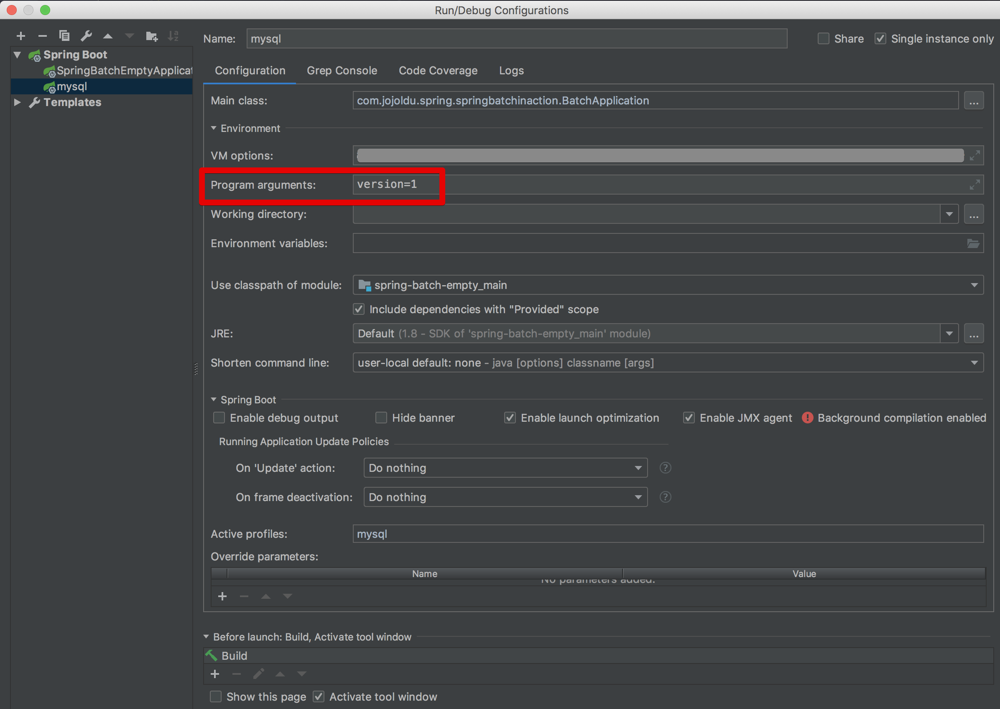
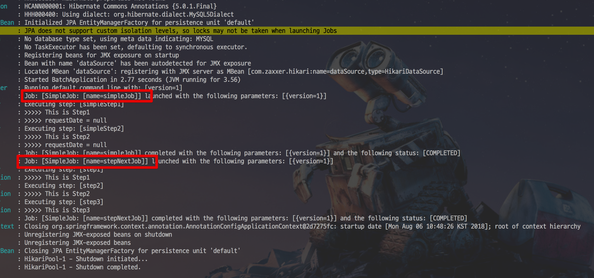
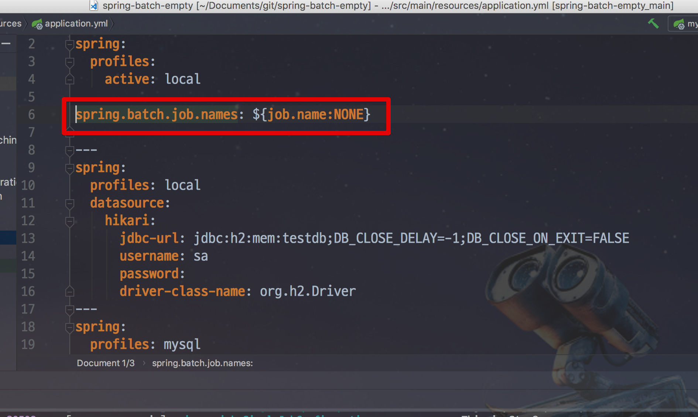
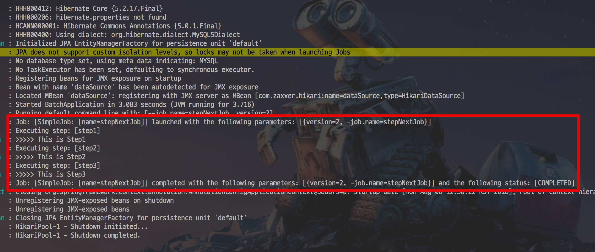
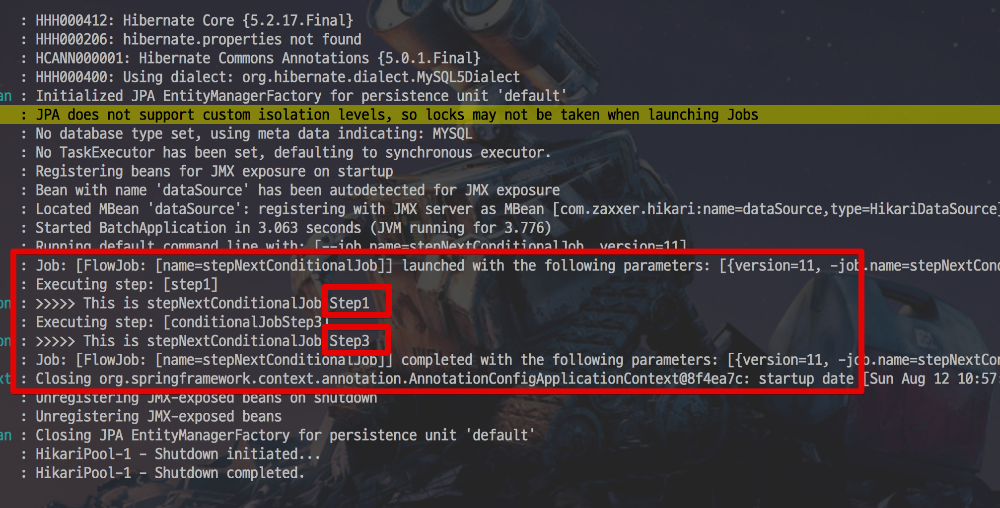
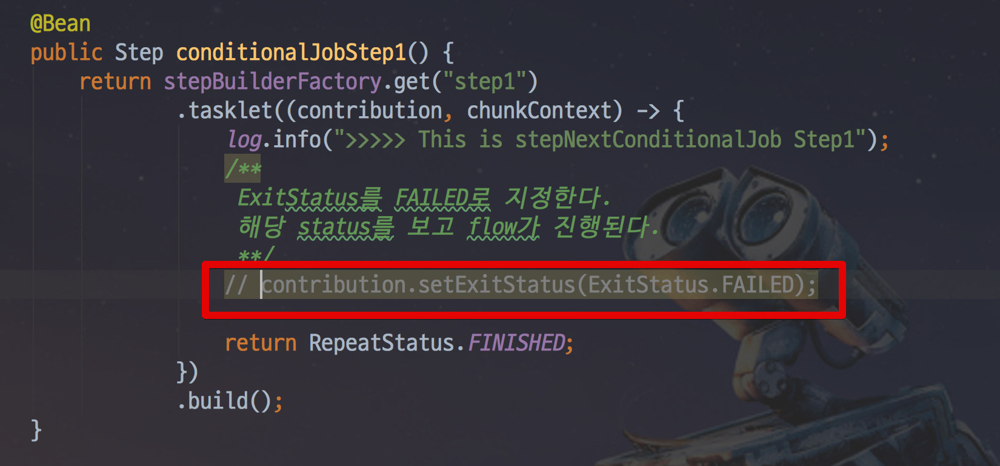
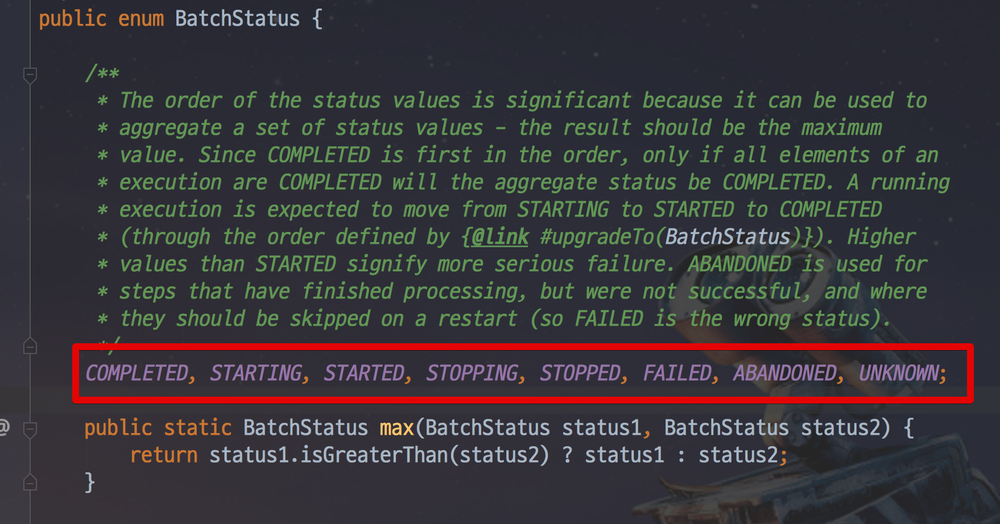
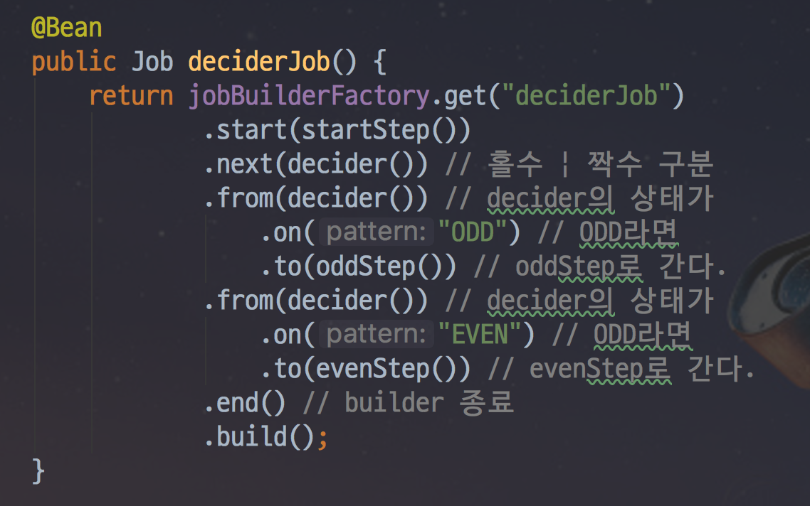
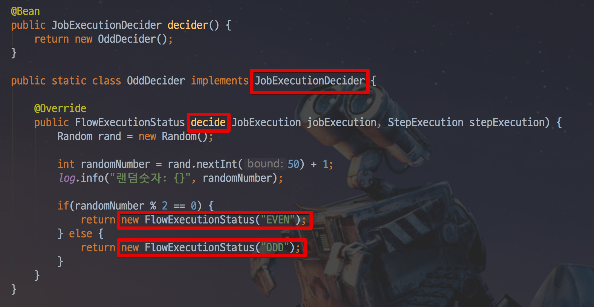

# 4. Spring Batch Job Flow

자 이번 시간부터 본격적으로 실전에서 사용할 수 있는 Spring Batch 내용들을 배워보겠습니다.

> 작업한 모든 코드는 [Github](https://github.com/jojoldu/spring-batch-in-action)에 있으니 참고하시면 됩니다.  

앞서 Spring Batch의 Job을 구성하는데는 Step이 있다고 말씀드렸습니다.  
Step은 **실제 Batch 작업을 수행하는 역할**을 합니다.  
이전에 작성한 코드를 보시면 Job은 코드가 거의 없죠?  
  
실제로 Batch 비지니스 로직을 처리하는 (```ex: log.info()```) 기능은 Step에 구현되어 있습니다.  
이처럼 Step에서는 **Batch로 실제 처리하고자 하는 기능과 설정을 모두 포함**하는 장소라고 생각하시면 됩니다.  
  
Batch 처리 내용을 담다보니, Job 내부의 **Step들간에 순서 혹은 처리 흐름을 제어**할 필요가 있는데요.  
이번엔 여러 Step들을 어떻게 관리할지에 대해서 알아보겠습니다.  

## 4-1. Next

첫번째로 배워볼 것은 **Next** 입니다.  

Next는 앞서 ```simpleJob```을 진행하면서 조금 다뤄봤었죠?  
샘플코드를 한번 작성해보겠습니다.    
이번에 만들 배치는 ```StepNextJobConfiguration.java``` 로 만들겠습니다.

```java
@Slf4j
@Configuration
@RequiredArgsConstructor
public class StepNextJobConfiguration {

    private final JobBuilderFactory jobBuilderFactory;
    private final StepBuilderFactory stepBuilderFactory;

    @Bean
    public Job stepNextJob() {
        return jobBuilderFactory.get("stepNextJob")
                .start(step1())
                .next(step2())
                .next(step3())
                .build();
    }

    @Bean
    public Step step1() {
        return stepBuilderFactory.get("step1")
                .tasklet((contribution, chunkContext) -> {
                    log.info(">>>>> This is Step1");
                    return RepeatStatus.FINISHED;
                })
                .build();
    }

    @Bean
    public Step step2() {
        return stepBuilderFactory.get("step2")
                .tasklet((contribution, chunkContext) -> {
                    log.info(">>>>> This is Step2");
                    return RepeatStatus.FINISHED;
                })
                .build();
    }

    @Bean
    public Step step3() {
        return stepBuilderFactory.get("step3")
                .tasklet((contribution, chunkContext) -> {
                    log.info(">>>>> This is Step3");
                    return RepeatStatus.FINISHED;
                })
                .build();
    }
}
```

보시는 것처럼 ```next()```는 **순차적으로 Step들 연결시킬때 사용**됩니다.  
step1 -> step2 -> stpe3 순으로 하나씩 실행시킬때 ```next()``` 는 좋은 방법입니다.  
  
자 그럼 순차적으로 호출되는지 한번 실행해볼까요?  
이번에는 Job Parameter를 ```version=1```로 변경하신뒤



실행해보시면!



stepNextJob 배치가 실행되긴 했지만, **기존에 있던 simpleJob도 실행**되었습니다.  

저희는 방금 만든 stepNextJob 배치만 실행하고 싶은데, 작성된 모든 배치가 실행되면 사용할 수 없겠죠?  
그래서 **지정한 배치만 수행되도록** 살짝? 설정을 변경해보겠습니다.

### 번외 1. 지정한 Batch Job만 실행되도록

프로젝트의 ```src/main/resources/application.yml``` 에 아래의 코드를 추가합니다.

```yaml
spring.batch.job.names: ${job.name:NONE}
```



추가된 옵션이 하는 일은 간단합니다.  
Spring Batch가 실행될때, **Program arguments로 ```job.name``` 값이 넘어오면 해당 값과 일치하는 Job만 실행**하겠다는 것입니다.  
여기서 ```${job.name:NONE}```을 보면 ```:```를 사이에 두고 좌측에 ```job.name```이, 우측에 ```NONE```이 있는데요.  
이 코드의 의미는 ```job.name```**이 있으면** ```job.name```**값을 할당하고, 없으면** ```NONE```**을 할당**하겠다는 의미입니다.  
중요한 것은! ```spring.batch.job.names```에 ```NONE```이 할당되면 **어떤 배치도 실행하지 않겠다는 의미**입니다.  
즉, 혹시라도 **값이 없을때 모든 배치가 실행되지 않도록 막는 역할**입니다.  
  
자 그럼 위에서 언급한 ```job.name```을 배치 실행시에 Program arguments로 넘기도록 IDE의 실행환경을 다시 수정하겠습니다.  
  
IDE의 실행 환경에서 저희가 Job Parameter를 수정했던 Program arguments 항목에 아래와 같이 코드를 입력합니다.

```java
--job.name=stepNextJob
```


 
이것만 추가하시면 됩니다.  
(옆에 있는 **version은 1번이 이미 실행됐으니 2로 변경하셔야 합니다**.)  

자 그럼 저장하시고, 한번 실행해보겠습니다.  
version=2로 변경했으니 Job Instance 중복 문제는 발생하지 않을테니 정상적으로 ```stepNextJob```만 실행되야하겠죠?  
  
한번 실행해보시면!



지정한 ```stepNextJob```만 수행되었습니다!  
이제는 필요한 Job만 값만 바꿔가며 실행하면 되겠죠?  

> 실제 운영 환경에서는 ```java -jar batch-application.jar --job.name=simpleJob ``` 과 같이 배치를 실행합니다.  
이런 운영 환경부분은 시리즈 후반부에 소개드리겠습니다.

## 4-2. 조건별 흐름 제어 (Flow)

자 Next가 순차적으로 Step의 순서를 제어한다는 것을 알게 됐습니다.  
여기서 중요한 것은, **앞의 step에서 오류가 나면 나머지 뒤에 있는 step 들은 실행되지 못한다**는 것입니다.  
  
하지만 상황에 따라 **정상일때는 Step B로, 오류가 났을때는 Step C로 수행해야할때**가 있습니다.  


이럴 경우를 대비해 Spring Batch Job에서는 조건별로 Step을 사용할 수 있습니다.  
새로운 클래스 ```StepNextConditionalJobConfiguration``` 를 생성해서 살펴보겠습니다.  

```java
@Slf4j
@Configuration
@RequiredArgsConstructor
public class StepNextConditionalJobConfiguration {

    private final JobBuilderFactory jobBuilderFactory;
    private final StepBuilderFactory stepBuilderFactory;

    @Bean
    public Job stepNextConditionalJob() {
        return jobBuilderFactory.get("stepNextConditionalJob")
                .start(conditionalJobStep1())
                    .on("FAILED") // FAILED 일 경우
                    .to(conditionalJobStep3()) // step3으로 이동한다.
                    .on("*") // step3의 결과 관계 없이 
                    .end() // step3으로 이동하면 Flow가 종료한다.
                .from(conditionalJobStep1()) // step1로부터
                    .on("*") // FAILED 외에 모든 경우
                    .to(conditionalJobStep2()) // step2로 이동한다.
                    .next(conditionalJobStep3()) // step2가 정상 종료되면 step3으로 이동한다.
                    .on("*") // step3의 결과 관계 없이 
                    .end() // step3으로 이동하면 Flow가 종료한다.
                .end() // Job 종료
                .build();
    }

    @Bean
    public Step conditionalJobStep1() {
        return stepBuilderFactory.get("step1")
                .tasklet((contribution, chunkContext) -> {
                    log.info(">>>>> This is stepNextConditionalJob Step1");
                    
                    /**
                        ExitStatus를 FAILED로 지정한다.
                        해당 status를 보고 flow가 진행된다.
                    **/
                    contribution.setExitStatus(ExitStatus.FAILED);

                    return RepeatStatus.FINISHED;
                })
                .build();
    }

    @Bean
    public Step conditionalJobStep2() {
        return stepBuilderFactory.get("conditionalJobStep2")
                .tasklet((contribution, chunkContext) -> {
                    log.info(">>>>> This is stepNextConditionalJob Step2");
                    return RepeatStatus.FINISHED;
                })
                .build();
    }

    @Bean
    public Step conditionalJobStep3() {
        return stepBuilderFactory.get("conditionalJobStep3")
                .tasklet((contribution, chunkContext) -> {
                    log.info(">>>>> This is stepNextConditionalJob Step3");
                    return RepeatStatus.FINISHED;
                })
                .build();
    }
}
```

위의 코드 시나리오는 step1이 실패하냐 성공하냐에 따라 시나리오가 달라지는데요.

* step1 실패 시나리오: step1 -> step3
* step1 성공 시나리오: step1 -> step2 -> step3

이런 전체 Flow를 관리하는 코드가 바로 아래입니다.


* ```.on()```
    * 캐치할 **ExitStatus** 지정
    * ```*``` 일 경우 모든 ExitStatus가 지정된다.
* ```to()```
    * 다음으로 이동할 Step 지정
* ```from()``` 
    * 일종의 **이벤트 리스너** 역할
    * 상태값을 보고 일치하는 상태라면 ```to()```에 포함된 ```step```을 호출합니다.
    * step1의 이벤트 캐치가 FAILED로 되있는 상태에서 **추가로 이벤트 캐치**하려면 ```from```을 써야만 함
* ```end()```
    * end는 FlowBuilder를 반환하는 end와 FlowBuilder를 종료하는 end 2개가 있음
    * ```on("*")```뒤에 있는 end는 FlowBuilder를 반환하는 end
    * ```build()``` 앞에 있는 end는 FlowBuilder를 종료하는 end
    * FlowBuilder를 반환하는 end 사용시 계속해서 ```from```을 이어갈 수 있음

여기서 중요한 점은 ```on```이 캐치하는 상태값이 BatchStatus가 아닌 ExitStatus라는 점입니다.  
그래서 분기처리를 위해 상태값 조정이 필요하시다면 ExitStatus를 조정해야합니다.  
조정하는 코드는 아래와 같습니다.


본인이 원하는 상황에 따라 분기로직을 작성하여 ```contribution.setExitStatus```의 값을 변경하시면 됩니다.  
여기서는 먼저 FAILED를 발생시켜 step1 -> step3 flow를 테스트 해보겠습니다.  
  
자 이렇게 코드가 다 작성되셨으면 한번 실행해봅니다.



**step1과 step3만 실행**된 것을 확인할 수 있습니다!  
ExitStatus.FAILED로 인해 step2가 무시되고 실행되었죠?  
자 그럼 코드를 조금 수정해서 step1->step2->step3이 되는지 확인해보겠습니다.



주석을 걸고, 다시 실행해보시면!


정상 Flow로 step1->step2->step3가 차례로 수행된것을 확인할 수 있습니다!  
자 이젠 조건별로 다른 Step을 호출해야할 경우 아주 쉽게 할 수 있겠죠?

### 번외 2. Batch Status vs. Exit Status

위에서 나온 조건별 흐름 제어를 설명할때 잠깐 언급했지만, **BatchStatus와 ExitStatus**의 차이를 아는 것이 중요합니다.  
  
BatchStatus는 **Job 또는 Step 의 실행 결과를 Spring에서 기록할 때 사용**하는 Enum입니다.  
BatchStatus로 사용 되는 값은 COMPLETED, STARTING, STARTED, STOPPING, STOPPED, FAILED, ABANDONED, UNKNOWN 있는데요.  
대부분의 값들은 단어와 같은 뜻으로 해석하여 이해하시면 됩니다.



예를 들어,

```xml
.on("FAILED").to(stepB())
```

위 코드에서 ```on``` 메소드가 참조하는 것은 BatchStatus 으로 생각할 수 있지만 실제 참조되는 값은 **Step의 ExitStatus**압나다.  
  
ExitStatus는 **Step의 실행 후 상태**를 얘기합니다.  


(```ExitStatus```는 Enum이 아닙니다.)

위 예제 (```.on("FAILED").to(stepB())```) 를 좀더 쉽게 풀이 하자면 **exitCode가 FAILED로 끝나게 되면 StepB로 가라**는 뜻입니다.  
Spring Batch는 **기본적으로 ExitStatus의 exitCode는 Step의 BatchStatus와 같도록** 설정이 되어 있습니다.  
하지만 만약에 본인만의 커스텀한 exitCode가 필요하다면 어떻게 해야할까요?  
(즉, BatchStatus와 달라야하는 상황입니다.)   
   
예제 코드를 살펴보겠습니다.

```xml
.start(step1())
    .on("FAILED")
    .end()
.from(step1())
    .on("COMPLETED WITH SKIPS")
    .to(errorPrint1())
    .end()
.from(step1())
    .on("*")
    .to(step2())
    .end()
```

위 step1의 실행 결과는 다음과 같이 3가지가 될 수 있습니다.

* step1이 실패하며, Job 또한 실패하게 된다.
* step1이 성공적으로 수행되어 step2가 수행된다.
* step1이 성공적으로 완료되며, ```COMPLETED WITH SKIPS```의 exit 코드로 종료 된다. 

위 코드에 나오는 ```COMPLETED WITH SKIPS```는 ExitStatus에는 없는 코드입니다.  
원하는대로 처리되기 위해서는 ```COMPLETED WITH SKIPS``` exitCode를 반환하는 별도의 로직이 필요합니다.

```java
public class SkipCheckingListener extends StepExecutionListenerSupport {
 
    public ExitStatus afterStep(StepExecution stepExecution) {
        String exitCode = stepExecution.getExitStatus().getExitCode();
        if (!exitCode.equals(ExitStatus.FAILED.getExitCode()) && 
              stepExecution.getSkipCount() > 0) {
            return new ExitStatus("COMPLETED WITH SKIPS");
        }
        else {
            return null;
        }
    }
}
```

위 코드를 설명하면 StepExecutionListener 에서는 먼저 Step이 성공적으로 수행되었는지 확인하고, **StepExecution의 skip 횟수가 0보다 클 경우** ```COMPLETED WITH SKIPS``` **의 exitCode를 갖는 ExitStatus를 반환**합니다.

## 4-3. Decide

자 위에서 (4-2)에서 Step의 결과에 따라 서로 다른 Step으로 이동하는 방법을 알아보았습니다.  
이번에는 다른 방식의 분기 처리를 알아 보겠습니다.  
위에서 진행했던 방식은 2가지 문제가 있습니다.  

* Step이 담당하는 역할이 2개 이상이 됩니다.
    * 실제 해당 Step이 처리해야할 로직외에도 분기처리를 시키기 위해 ExitStatus 조작이 필요합니다.
* 다양한 분기 로직 처리의 어려움
    * ExitStatus를 커스텀하게 고치기 위해선 Listener를 생성하고 Job Flow에 등록하는 등 번거로움이 존재합니다.

명확하게 Step들간의 Flow 분기만 담당하면서 다양한 분기처리가 가능한 타입이 있으면 편하겠죠?  
그래서 Spring Batch에서는 Step들의 Flow속에서 **분기만 담당하는 타입**이 있습니다.  
JobExecutionDecider 라고 하며, 이를 사용한 샘플 코드를 한번 만들어보겠습니다.  
클래스명은 ```DeciderJobConfiguration```로 하겠습니다.

```java
@Slf4j
@Configuration
@RequiredArgsConstructor
public class DeciderJobConfiguration {
    private final JobBuilderFactory jobBuilderFactory;
    private final StepBuilderFactory stepBuilderFactory;

    @Bean
    public Job deciderJob() {
        return jobBuilderFactory.get("deciderJob")
                .start(startStep())
                .next(decider()) // 홀수 | 짝수 구분
                .from(decider()) // decider의 상태가
                    .on("ODD") // ODD라면
                    .to(oddStep()) // oddStep로 간다.
                .from(decider()) // decider의 상태가
                    .on("EVEN") // ODD라면
                    .to(evenStep()) // evenStep로 간다.
                .end() // builder 종료
                .build();
    }

    @Bean
    public Step startStep() {
        return stepBuilderFactory.get("startStep")
                .tasklet((contribution, chunkContext) -> {
                    log.info(">>>>> Start!");
                    return RepeatStatus.FINISHED;
                })
                .build();
    }

    @Bean
    public Step evenStep() {
        return stepBuilderFactory.get("evenStep")
                .tasklet((contribution, chunkContext) -> {
                    log.info(">>>>> 짝수입니다.");
                    return RepeatStatus.FINISHED;
                })
                .build();
    }

    @Bean
    public Step oddStep() {
        return stepBuilderFactory.get("oddStep")
                .tasklet((contribution, chunkContext) -> {
                    log.info(">>>>> 홀수입니다.");
                    return RepeatStatus.FINISHED;
                })
                .build();
    }

    @Bean
    public JobExecutionDecider decider() {
        return new OddDecider();
    }

    public static class OddDecider implements JobExecutionDecider {

        @Override
        public FlowExecutionStatus decide(JobExecution jobExecution, StepExecution stepExecution) {
            Random rand = new Random();

            int randomNumber = rand.nextInt(50) + 1;
            log.info("랜덤숫자: {}", randomNumber);

            if(randomNumber % 2 == 0) {
                return new FlowExecutionStatus("EVEN");
            } else {
                return new FlowExecutionStatus("ODD");
            }
        }
    }
}

```

이 Batch의 Flow는 다음과 같습니다.

* startStep -> oddDecider에서 홀수 인지 짝수인지 구분 -> oddStep or evenStep 진행

decider를 Flow 사이에 넣는 로직은 아래와 같습니다.



* ```start()```
    * Job Flow의 첫번째 Step을 시작합니다.
* ```next()```
    * ```startStep``` 이후에 ```decider```를 실행합니다.
* ```from()```
    * 4-2와 마찬가지로 from은 이벤트 리스너 역할을 합니다.
    * decider의 상태값을 보고 일치하는 상태라면 ```to()```에 포함된 ```step``` 를 호출합니다.

코드는 4-2와 크게 차이가 나지 않기 때문에 이해하시는데 어려움은 없으실것 같습니다.  

보시면 아시겠지만, 분기 로직에 대한 모든 일은 ```OddDecider```가 전담하고 있습니다.  
아무리 복잡한 분기로직이 필요하더라도 Step과는 명확히 **역할과 책임이 분리**된채 진행할 수 있게 되었습니다.  
  
자 그럼 Decider 구현체를 살펴보겠습니다.  



JobExecutionDecider 인터페이스를 구현한 OddDecider입니다.  
여기서는 랜덤하게 숫자를 생성하여 홀수/짝수인지에 따라 서로 다른 상태를 반환합니다.  
주의하실 것은 Step으로 처리하는게 아니기 때문에 ExitStatus가 아닌 ```FlowExecutionStatus```로 상태를 관리합니다.  
  
아주 쉽게 EVEN, ODD라는 상태를 생성하여 반환하였고, 이를 ```from().on()``` 에서 사용하는 것을 알 수 있습니다.  
자 그럼 이 코드를 한번 실해볼까요?


여러번 실행해보시면 홀수/짝수가 나오면서 서로 다른 step (oddStep, evenStep)이 실행되는 것을 확인할 수 있습니다!  
  
## 마무리

어떠셨나요?  
어렵진 않으셨나요?  
Spring Batch Job 구성시 어떻게 Job Flow를 구성하면 될지 힌트가 되셨다면 좋겠습니다.  
다음 시간에는 Spring Batch의 가장 중요한 개념인 ```Scope```에 대해서 진행하겠습니다.  
긴 글 끝까지 봐주셔서 감사합니다 :)

## 참고

* [VM Arguments, Program arguments](https://stackoverflow.com/a/37439625)