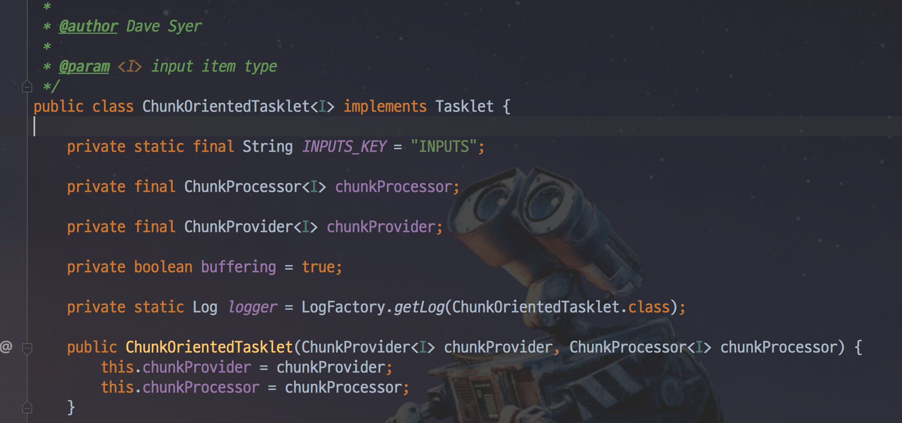
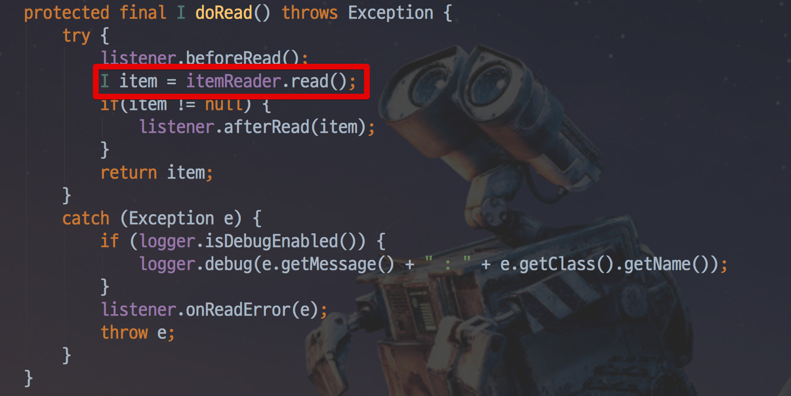
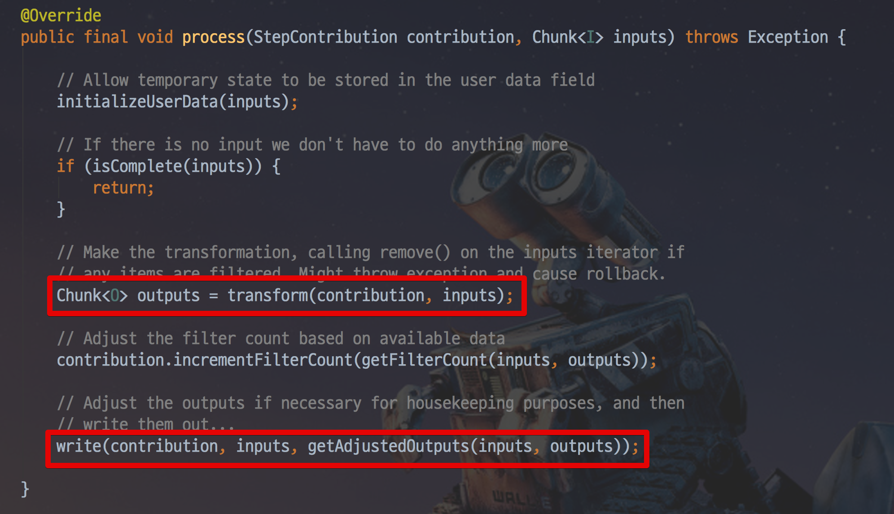
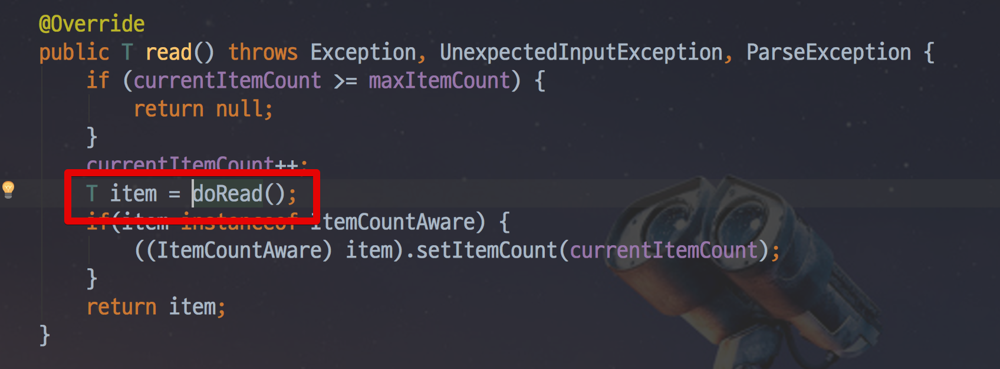

# 6. Chunk 지향 처리
 
Spring Batch의 큰 장점 중 하나로 Chunk 지향 처리를 얘기합니다.  
이번 시간에는 Chunk 지향 처리가 무엇인지 한번 살펴보겠습니다.

## 6-1. Chunk?

Spring Batch에서의 Chunk란 데이터 덩어리로 작업 할 때 **각 커밋 사이에 처리되는 row 수**를 얘기합니다.  
즉, Chunk 지향 처리란 **한 번에 하나씩 데이터를 읽어 Chunk라는 덩어리를 만든 뒤, Chunk 단위로 트랜잭션**을 다루는 것을 의미합니다.  
  
여기서 트랜잭션이라는게 중요한데요.  
Chunk 단위로 트랜잭션을 수행하기 때문에 **실패할 경우엔 해당 Chunk 만큼만 롤백**이 되고, 이전에 커밋된 트랜잭션 범위까지는 반영이 된다는 것입니다.  
  
Chunk 지향 처리가 결국 Chunk 단위로 데이터를 처리한다는 의미이기 때문에 그림으로 표현하면 아래와 같습니다.
  


> [공식 문서의 그림](https://docs.spring.io/spring-batch/4.0.x/reference/html/index-single.html#chunkOrientedProcessing)은 **개별 item이 처리되는 것만** 다루고 있습니다.
위 그림은 Chunk 단위까지 다루고 있어 조금 다르니 주의해주세요.

* Reader에서 데이터를 하나 읽어옵니다
* 읽어온 데이터를 Processor에서 가공합니다 
* 가공된 데이터들을 별도의 공간에 모은 뒤, Chunk 단위만큼 쌓이게 되면 Writer에 전달하고 Writer는 일괄 저장합니다.  

**Reader와 Processor에서는 1건씩 다뤄지고, Writer에선 Chunk 단위로 처리**된다는 것만 기억하시면 됩니다.  
  
Chunk 지향 처리를 Java 코드로 표현하면 아래처럼 될 것 같습니다.

```java

for(int i=0; i<totalSize; i+=chunkSize){ // chunkSize 단위로 묶어서 처리
    List items = new Arraylist();
    for(int j = 0; j < chunkSize; j++){
        Object item = itemReader.read()
        Object processedItem = itemProcessor.process(item);
        items.add(processedItem);
    }
    itemWriter.write(items);
}
```

**chunkSize별로 묶어서 처리**된다는 의미가 이해가 되셨나요?  
자 그럼 이제 Chunk 지향 처리가 어떻게 되고 있는지 실제 Spring Batch 내부 코드를 보면서 알아보겠습니다.

## 6-2. ChunkOrientedTasklet 엿보기

Chunk 지향 처리의 전체 로직을 다루는 것은 ```ChunkOrientedTasklet``` 클래스입니다.  
클래스 이름만 봐도 어떤 일을 하는지 단번에 알 수 있을것 같습니다.



여기서 자세히 보셔야할 코드는 ```execute()``` 입니다.  
Chunk 단위로 작업하기 위한 전체 코드가 이곳에 있다고 보시면 되는데요.  
내부 코드는 아래와 같습니다.


* ```chunkProvider.provide()```로 Reader에서 Chunk size만큼 데이터를 가져옵니다.
* ```chunkProcessor.process()``` 에서 Reader로 받은 데이터를 가공(Processor)하고 저장(Writer)합니다.

데이터를 가져오는 ```chunkProvider.provide()```를 가보시면 어떻게 데이터를 가져오는지 알 수 있습니다.


 ```inputs```이 ChunkSize만큼 쌓일때까지 ```read()```를 호출합니다.  
이 ```read()``` 는 내부를 보시면 실제로는 ```ItemReader.read```를 호출합니다.  




즉, ```ItemReader.read```에서 1건씩 데이터를 조회해 Chunk size만큼 데이터를 쌓는 것이 ```provide()```가 하는 일입니다.  
  
자 그럼 이렇게 쌓아준 데이터를 어떻게 가공하고 저장하는지 한번 확인해보겠습니다.

## 6-3. SimpleChunkProcessor 엿보기

Processor와 Writer 로직을 담고 있는 것은 ```ChunkProcessor``` 가 담당하고 있습니다.  


인터페이스이기 때문에 실제 구현체가 있어야 하는데요.  
기본적으로 사용되는 것이 ```SimpleChunkProcessor``` 입니다.  


위 클래스를 보시면 Spring Batch에서 Chunk 단위 처리를 어떻게 하는지 아주 상세하게 확인할 수 있습니다.  
처리를 담당하는 핵심 로직은 ```process()``` 입니다.  
이 ```process()```의 코드는 아래와 같습니다.




* ```Chunk<I> inputs```를 파라미터로 받습니다.
    * 이 데이터는 앞서 ```chunkProvider.provide()``` 에서 받은 ChunkSize만큼 쌓인 item입니다.
* ```transform()``` 에서는 전달 받은 ```inputs```을 ```doProcess()```로 전달하고 변환값을 받습니다.
* ```transform()```을 통해 가공된 대량의 데이터는 ```write()```를 통해 일괄 저장됩니다.
    * ```write()```는 저장이 될수도 있고, 외부 API로 전송할 수 도 있습니다.
    * 이는 개발자가 ItemWriter를 어떻게 구현했는지에 따라 달라집니다.

여기서 ```transform()```은 반복문을 통해 ```doProcess()```를 호출하는데요.  
해당 메소드는 ItemProcessor의 ```process()```를 사용합니다.


 ```doProcess()``` 를 처리하는데 만약 ItemProcessor가 없다면 item을 그대로 반환하고 있다면 ItemProcessor의 ```process()```로 가공하여 반환합니다.


그리고 이렇게 가공된 데이터들은 위에서도 나와있듯이 SimpleChunkProcessor의 ```doWrite()``` 를 호출하여 일괄 처리 합니다.


자 Chunk 지향 처리에 대해 실제 코드를 보면서 어떻게 처리되는지 알아보았습니다.  
아래에서는 ChunkSize에 대한 오해를 한번 풀어보겠습니다.

## 6-4. Page Size vs Chunk Size

기존에 Spring Batch를 사용해보신 분들은 아마 PagingItemReader를 많이들 사용해보셨을 것입니다.  
PagingItemReader를 사용하신 분들 중 간혹 Page Size와 Chunk Size를 같은 의미로 오해하시는 분들이 계시는데요.  
**Page Size와 Chunk Size는 서로 의미하는 바가 다릅니다**.  
  
**Chunk Size는 한번에 처리될 트랜잭션 단위**를 얘기하며, **Page Size는 한번에 조회할 Item의 양**을 얘기합니다.  
  
자 그럼 이제 2개가 어떻게 다른지 실제 Spring Batch의 ItemReader 코드를 직접 들여다보겠습니다.  
  
PagingItemReader의 부모 클래스인 ```AbstractItemCountingItemStreamItemReader```의 ```read()``` 메소드를 먼저 보겠습니다.



보시는것처럼 읽어올 데이터가 있다면 ```doRead()```를 호출합니다.  
  
 ```doRead()```의 코드는 아래와 같습니다.


 ```doRead()```에서는 현재 읽어올 데이터가 없거나, Page Size를 초과한 경우 ```doReadPage()```를 호출합니다.  
읽어올 데이터가 없는 경우는 read가 처음 시작할 때를 얘기합니다.  
Page Size를 초과하는 경우는 예를 들면 Page Size가 10인데, 이번에 읽어야할 데이터가 11번째 데이터인 경우입니다.  
이럴 경우 Page Size를 초과했기 때문에 ```doReadPage()``` 를 호출한다고 보시면 됩니다.  
  
즉, **Page 단위로 끊어서 조회**하는 것입니다.  

> 게시판 만들기에서 페이징 조회를 떠올려보시면 쉽게 이해가 되실것 같습니다.

 ```doReadPage()```부터는 하위 구현 클래스에서 각자만의 방식으로 페이징 쿼리를 생성합니다.  
여기서는 보편적으로 많이 사용하시는 **JpaPagingItemReader** 코드를 살펴보겠습니다.  
  
JpaPagingItemReader의 ```doReadPage()```의 코드는 아래와 같습니다.


Reader에서 지정한 Page Size만큼 ```offset```, ```limit``` 값을 지정하여 페이징 쿼리를 생성 (```createQuery()```)하고, 사용 (```query.getResultList()```) 합니다.  
쿼리 실행 결과는 ```results```에 저장합니다.  
이렇게 저장된 ```results```에서 ```read()``` 가 **호출될때마다 하나씩 꺼내서 전달**합니다.  
  
즉, Page Size는 **페이징 쿼리에서 Page의 Size를 지정하기 위한 값**입니다.  
  
만약 2개 값이 다르면 어떻게 될까요?  
PageSize가 10이고, ChunkSize가 50이라면 **ItemReader에서 Page 조회가 5번 일어나면 1번 의 트랜잭션이 발생하여 Chunk가 처리**됩니다.  
  
한번의 트랜잭션 처리를 위해 5번의 쿼리 조회가 발생하기 때문에 성능상 이슈가 발생할 수 있습니다.    그래서 Spring Batch의 PagingItemReader에는 클래스 상단에 다음과 같은 주석을 남겨두었습니다.

> Setting a fairly large page size and using a commit interval that matches the page size should provide better performance.  
(상당히 큰 페이지 크기를 설정하고 페이지 크기와 일치하는 커미트 간격을 사용하면 성능이 향상됩니다.)

성능상 이슈 외에도 2개 값을 다르게 할 경우 JPA를 사용하신다면 영속성 컨텍스트가 깨지는 문제도 발생합니다.  
(이전에 관련해서 [문제를 정리](http://jojoldu.tistory.com/146)했으니 참고해보세요)  
  
2개 값이 의미하는 바가 다르지만 위에서 언급한 여러 이슈로 **2개 값을 일치시키는 것이 보편적으로 좋은 방법**이니 꼭 2개 값을 일치시키시길 추천드립니다.

## 6-5. 마무리

이번 시간에는 Spring Batch의 코드를 깊게 살펴봤습니다.  
이론적인 내용들이 많아서 조금 어려울 수도 있으실텐데요.  
Spring Batch의 전체 그림을 이해하는데 중요한 개념이니 꼭 숙지하고 가시길 추천드립니다.  
다음 시간부터 다시 Spring Batch의 예제 코드를 함께 진행하겠습니다.  
긴 글 끝까지 봐주셔서 감사합니다 :)

